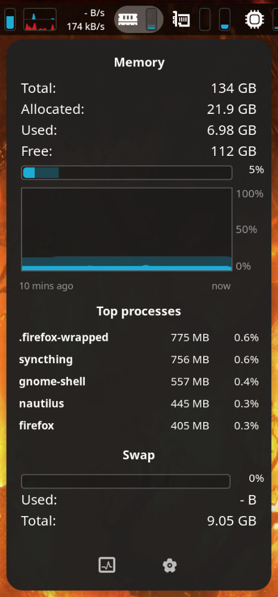
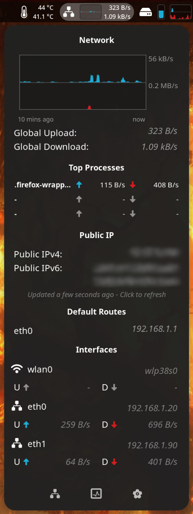

# Astra Monitor

## Table of Contents

-   [Overview](#overview)
-   [Roadmap](#roadmap)
-   [Installation](#installation)
-   [Requirements](#requirements)
-   [Usage](#usage)
-   [Licensing](#licensing)
-   [Translations](#translations)
-   [Building and Testing](#building-and-testing)
-   [Contributing](#contributing)
-   [Donations](#donations)
-   [Acknowledgments](#acknowledgments)
-   [Star History](#star-history)

# Overview

Astra Monitor is a cutting-edge, fully customizable, and performance-focused monitoring extension for GNOME's top bar. It's an all-in-one solution for those seeking to keep a close eye on their system's performance metrics, like CPU, GPU, RAM, disk usage, network statistics, and sensor readings. Currently in its early stages of development, Astra Monitor is constantly evolving with an eye towards future enhancements and additional features.

### Key Features:

-   **Comprehensive Monitoring:** Track a wide array of system resources. Apart from the wide variety of resources to monitor in the top header bar, inside the menus you can find even more detailed information just by hovering over the resource you want to know more about.
-   **Customizable Interface:** Tailor the monitoring experience to suit your preferences. Choose what resources to monitor and how to display them. A lot of customization options are available.
-   **Optimized Performance:** Designed to be lightweight and efficient. Resources are only queried when needed. No polling. No wasted resources. Hidden components are not queried nor rendered.
-   **Effortless Real-Time Updates:** Changes made in the preferences panel are applied instantly, with no need to restart the extension or GNOME Shell. This feature ensures a seamless and interruption-free user experience, allowing for on-the-fly customization and monitoring adjustments.

_**Check the [COMPARISON.md](./COMPARISON.md) file for a detailed comparative analysis of Astra Monitor features, performance and benchmarks vs similar projects within our domain.**_

### Screenshots:

_**NOTE**: The screenshots below are from an outdated version of the extension and may not reflect the current release._

#### High Customization Level

<p align="center">
    Example 1:<br>
    <br>
    Example 2:<br>
    <br>
    Example 3:<br>
    
</p>

#### Rich Menu Information

<p align="center">
    
    
    
</p>

#### Detailed Resource Information

<p align="center">
    
    
    
</p>
<p align="center">
    
    
</p>

# Roadmap

As Astra Monitor is in beta stage of development, we have an ambitious roadmap planned:

<table style="text-align:center" align="center">
    <tr>
        <th style="text-align:center" colspan="2">Beta<br>3/6</th>
        <th style="text-align:center" colspan="2">Release<br>0/5</th>
    </tr>
    <tr>
        <th style="text-align:center">Q3 2024</th>
        <th style="text-align:center">Q4 2024</th>
        <th style="text-align:center">Q1 2025</th>
        <th style="text-align:center">Q2 2025</th>
    </tr>
    <tr>
        <td style="text-align:center">✅<br>Root Process Monitoring<br><span style="font-size: 13px;">(storage)</span></td>
        <td style="text-align:center">⌛<br>Help &amp; Doc</td>
        <td style="text-align:center">🔲<br>Themes</td>
        <td style="text-align:center">🔲<br>User Custom Commands</td>
    </tr>
    <tr>
        <td style="text-align:center">✅<br>Network Process Monitoring</td>
        <td style="text-align:center">🔲<br>Battery Monitoring</td>
        <td style="text-align:center"></td>
        <td style="text-align:center"></td>
    </tr>
    <tr>
        <td style="text-align:center"></td>
        <td style="text-align:center">🔲<br>Continuous Monitoring Mode</td>
        <td style="text-align:center"></td>
        <td style="text-align:center"></td>
    </tr>
</table>
<br>

To check our _**FULL Roadmap**_, including past releases, please refer to the [ROADMAP.md](./ROADMAP.md) file.

Your feedback is invaluable in shaping Astra Monitor's development journey. Do you have any new features to suggest? We are very happy to receive suggestions. The best way to see new features become reality as quickly as possible is through direct contributions or donations. Donations will result in more development time dedicated to the project. If you would like to contribute, please refer to the contribution guidelines.

# Installation

Astra Monitor can be installed on any Linux distribution supporting GNOME version 45.0 or higher.

### GNOME Extensions Manager

Most distributions with GNOME support the installation of extensions directly from the GNOME Extensions website. Check if your distro already has the GNOME Extensions Manager app installed. If not, you can install it from your package manager / software center.

### Using the GNOME Extensions Website

Follow these simple steps:

1. Visit the [GNOME Shell Extensions page](https://extensions.gnome.org/).
2. Search for "Astra Monitor".
3. Click on the extension and follow the on-screen instructions to install.

### NixOS

If you are using NixOS, you can install Astra Monitor adding the following to your `configuration.nix`:

```nix
{ config, pkgs, ... }:

{
  environment.systemPackages = with pkgs; [
    gnomeExtensions.astra-monitor
  ];
}
```

# Requirements

Astra Monitor works out of the box with no additional dependencies. However, some optional dependencies can enhance the data displayed by the extension. These tools and the impact of their absence are clearly listed in the preferences panel of the extension.

<p align="center">
    
</p>

### Libgtop

If you want to use Libgtop as a data source you may need to install the `libgtop` package. This package is not required for the extension to work, but it is recommended for a better experience.

Here is a non-exhaustive list of how to install `libgtop` on some popular Linux distributions:

#### Ubuntu/Debian

```bash
sudo apt install gir1.2-gtop-2.0
```

#### Fedora

```bash
sudo dnf install libgtop2-devel
```

#### Arch / Manjaro

```bash
sudo pacman -Syu libgtop
```

#### openSUSE

```bash
sudo zypper install libgtop-devel
```

#### NixOS

On NixOS, you may need to add the following to your `configuration.nix`:

```nix
environment.variables = {
    GI_TYPELIB_PATH = "/run/current-system/sw/lib/girepository-1.0";
};
environment.systemPackages = with pkgs; [
    libgtop
];
```

### Nethogs

Nethogs is an optional dependency for the extension. It is required to monitor network I/O activity of processes. If you want to use this feature, you may need to install `nethogs` package. Nethogs requires root access, which can be achieved in two ways:

1. On-demand: Click the network top processes header to grant permission and start `nethogs` with elevated privileges for about 60 seconds.
2. Always-on: Grant `nethogs` the necessary capabilities (`cap_net_admin` and `cap_net_raw=ep`) to run as a privileged service. The extension will automatically detect and use it in this configuration.

Here's how to grant the necessary capabilities to `nethogs` on most distros:

1. First, locate the `nethogs` binary:

    ```bash
    which nethogs
    ```

2. Grant the capabilities using `setcap`:

    ```bash
    sudo setcap cap_net_admin,cap_net_raw=ep $(which nethogs)
    ```

3. Verify the capabilities were set correctly:
    ```bash
    getcap $(which nethogs)
    ```
    You should see output similar to:
    ```
    /usr/sbin/nethogs = cap_net_admin,cap_net_raw=ep
    ```

_Note: The exact path to `nethogs` may vary depending on your system. Adjust the commands accordingly if `which nethogs` returns a different path._

After granting these capabilities, restart GNOME Shell and Astra Monitor will automatically detect and use `nethogs` without requiring elevated privileges each time.

#### NixOS

On NixOS, to grant the capabilities to `nethogs`, you may need to add the following to your `configuration.nix`:

```nix
environment.systemPackages = with pkgs; [
    nethogs
];

security.wrappers = {
    nethogs = {
        source = "${pkgs.nethogs}/bin/nethogs";
        capabilities = "cap_net_admin=ep cap_net_raw=ep";
        owner = "root";
        group = "root";
        permissions = "u+rx,g+x,o+x";
    };
};
```

_Note: This is an example configuration and may vary depending on your specific NixOS setup. Adjust the configuration as needed for your system._

# Usage

Once installed, Astra Monitor can be accessed and configured directly from the GNOME extensions tool. You can customize what system resources to monitor and how the information is displayed, tailoring the experience to your need.

# Licensing

Astra Monitor is licensed under the GNU General Public License v3.0 (GPL-3.0), a widely used free software license that guarantees end users the freedom to run, study, share, and modify the software.

# Translations

Astra Monitor is currently available in English, German, Czech and Russian. If you would like to contribute with a translation, please refer to these guidelines:

1. **Fork the repository:** Fork the repository and clone it to your local machine.
2. **Create/Update the translation file:** Create or update the translation file for your language. Translation files are located in po folder. The file name is the language code (e.g. `it.po` for Italian). You can use Poedit to edit the translation files.
3. **Compile the translation file:** Compile the translation file using the `./i18n.sh` script.
4. **Test the translation:** Test the translation by running the extension with the `./test.sh` script or by packing it with the `./pack.sh` script and installing it.
5. **Submit a pull request:** Submit a pull request with your changes.

_NOTE: TypeScript compilation is required to generate JavaScript files from the source code. Be sure to have TypeScript installed or search online how to install it on your system._

# Building and Testing

Astra Monitor is written in TypeScript and uses the [GNOME Shell Extension API](https://gjs.guide/).

You may run `npm install`, `yarn install` with Yarn or `nnpm install` using NNPM, to install all dependencies.

Various scripts are provided to facilitate packing and testing of the extension. These scripts are located in the root directory of the project and can be run from there. They are used solely with the scope of facilitating my own development process. Feel free to use or modify them to suit your needs.

### Scripts

-   **`test.sh`:** Compile, pack, install, and run the extension in a Xephyr session with a GNOME nested Wayland session, allowing for easy testing without restarting your own GNOME Shell session. It can be run with the following command:

    ```
    bash ./test.sh
    ```

-   **`schemas.sh`:** This script compiles the schemas for the extension. It can be run with the following command:

    ```
    bash ./schemas.sh
    ```

-   **`i18n.sh`:** This script creates the translations files for the extension. It can be run with the following command:

    ```
    bash ./i18n.sh
    ```

-   **`pack.sh`:** This script packs the extension into a zip file ready for distribution or use. It automatically checks dependencies and compiles schemas. It can be run with the following command:

    ```
    bash ./pack.sh
    ```

-   **`compile.sh`:** This script compiles the TypeScript source code into JavaScript; the output is placed in the `dist` directory. It can be run with the following command:

    ```
    bash ./compile.sh
    ```

# Contributing

Contributions to Astra Monitor are highly encouraged and appreciated. We welcome all forms of contributions, from bug reporting to feature suggestions, and direct code contributions. To contribute:

1. **Report Bugs/Request Features:** Use the GitHub issues page to report bugs or suggest new features.
2. **Code Contributions:** Feel free to make changes and submit a pull request.
3. **Feedback:** Share your experience and suggestions to help improve Astra Monitor.

Please refer to our contribution guidelines for more detailed instructions.

# Donations

Astra Monitor is a free and open-source project: we rely on the support of our community. Donations are a vital part of sustaining our project's growth and success. Your contributions enable us to dedicate more time to development and bring the community's most requested features to life.

### How Your Donations Help

-   **More Development Time**: Donations allow our team to spend more time directly on project development, leading to quicker releases and updates.
-   **Community-Driven Features**: With additional resources, we can focus on implementing features most requested by our community.
-   **Enhanced Project Sustainability**: Your support helps us maintain the project in the long run, ensuring its continual improvement and relevance.

### How to Donate

You can donate through your preferred platform. Any amount is greatly appreciated and makes a significant impact.

**Buy us [a coffee](https://www.buymeacoffee.com/astra.ext), and help us keep Astra Monitor alive and thriving!**

**Become a [Patron](https://www.patreon.com/AstraExt) to support our project and more!**

**Donate through [Ko-Fi](https://ko-fi.com/astraext), and help our community grow!**

## Acknowledgments

Astra Monitor is a project inspired by the concepts of [iStat Menus](https://bjango.com/mac/istatmenus/) and [TopHat](https://github.com/fflewddur/tophat) by [Todd Kulesza](https://github.com/fflewddur), adapted and evolved for the GNOME environment. This extension is a tribute to the innovation in system monitoring tools and is driven by the passion and contributions of the open-source community.

## Star History

<a href="https://star-history.com/#AstraExt/astra-monitor&Date">
  <picture>
    <source media="(prefers-color-scheme: dark)" srcset="https://api.star-history.com/svg?repos=AstraExt/astra-monitor&type=Date&theme=dark" />
    <source media="(prefers-color-scheme: light)" srcset="https://api.star-history.com/svg?repos=AstraExt/astra-monitor&type=Date" />
    
  </picture>
</a>
