# Astra Monitor

## 目录

-   [概述](#概述)
-   [路线图](#路线图)
-   [安装](#安装)
-   [依赖要求](#依赖要求)
-   [使用方法](#使用方法)
-   [许可证](#许可证)
-   [翻译](#翻译)
-   [编译和测试](#编译和测试)
-   [贡献](#贡献)
-   [捐赠](#捐赠)
-   [鸣谢](#鸣谢)
-   [Star 历史](#star-历史)

# 概述

Astra Monitor 是一款尖端的、完全可定制的、专注于性能的 GNOME 顶部栏监控扩展。它是一款一体化解决方案，适合那些希望密切关注系统性能指标的用户，如 CPU、GPU、RAM、磁盘使用率、网络统计和传感器读数。Astra Monitor 目前处于开发早期阶段，正在不断发展中，未来将会有更多增强功能和特性。

### 主要特点：

-   **全面监控：** 追踪各种系统资源。除了在顶部标题栏中可以监控的丰富资源外，在菜单内部您还可以通过将鼠标悬停在想要了解的资源上来获取更详细的信息。
-   **可定制界面：** 根据您的偏好定制监控体验。选择要监控的资源以及如何显示它们。提供了大量自定义选项。
-   **性能优化：** 轻量级且高效的设计。资源仅在需要时查询。无轮询，不浪费资源。隐藏的组件不会被查询或渲染。
-   **轻松的实时更新：** 对偏好设置面板所做的更改会立即应用，无需重启扩展或 GNOME Shell。此功能确保了无缝且不间断的用户体验，允许进行即时定制和监控调整。

_**查看 [COMPARISON.md](./COMPARISON.md) 文件，了解 Astra Monitor 与同类项目的功能、性能和基准测试的详细对比分析。**_

### 截图：

_**注意**：以下截图来自扩展的旧版本，可能无法反映当前发布版本。_

#### 高定制化程度

<p align="center">
    示例 1：<br>
    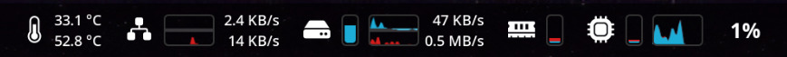<br>
    示例 2：<br>
    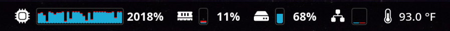<br>
    示例 3：<br>
    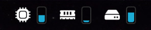
</p>

#### 丰富的菜单信息

<p align="center">
    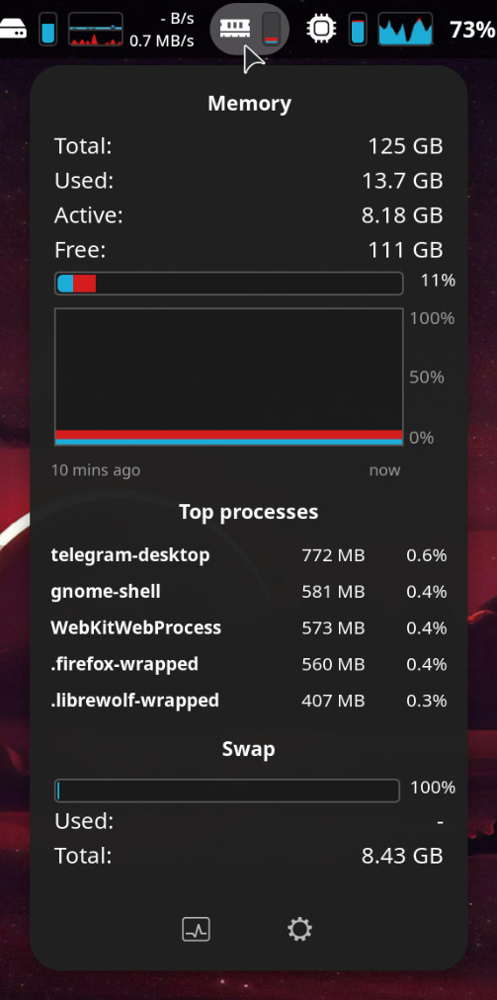
    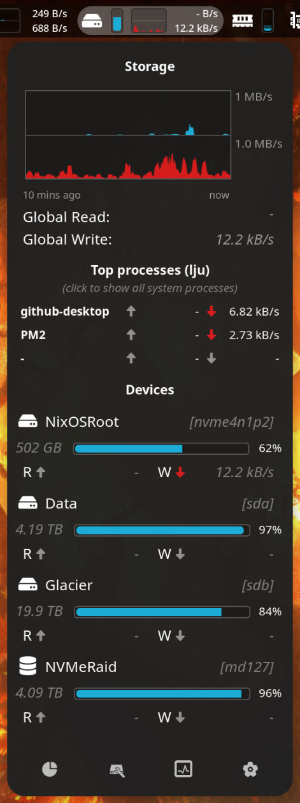
    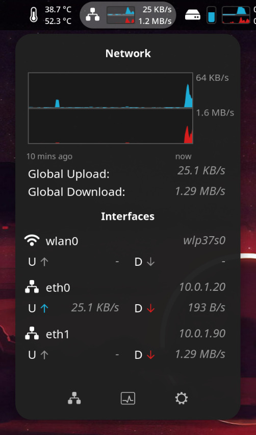
</p>

#### 详细的资源信息

<p align="center">
    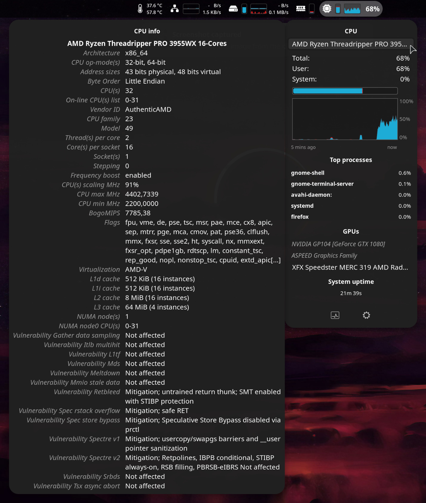
    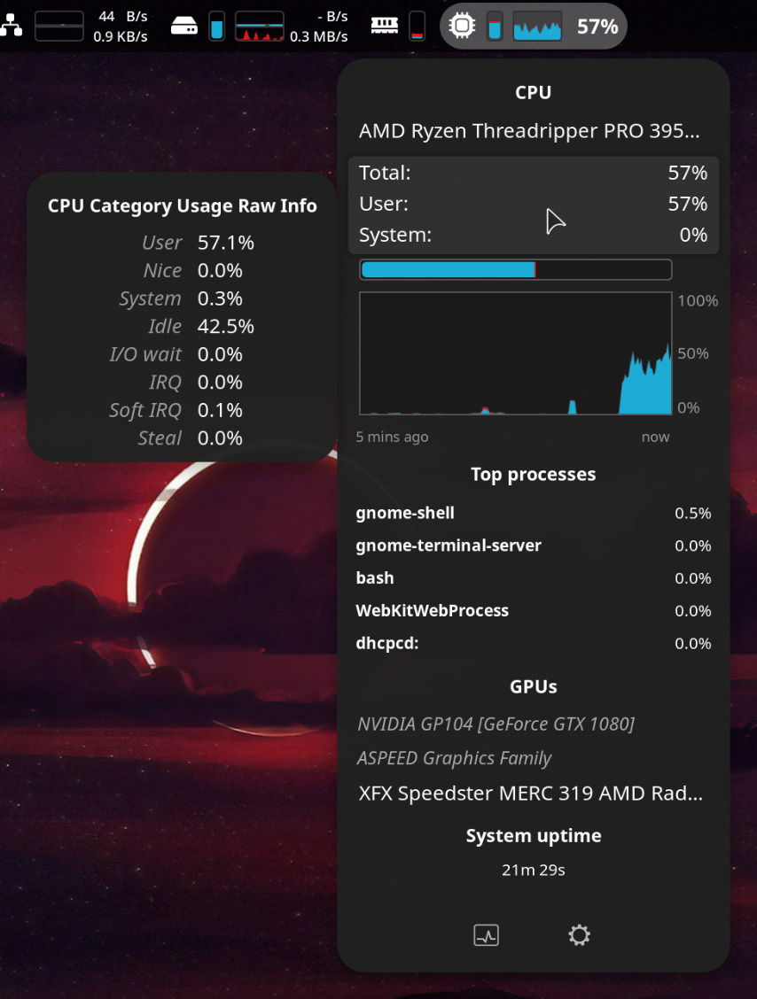
    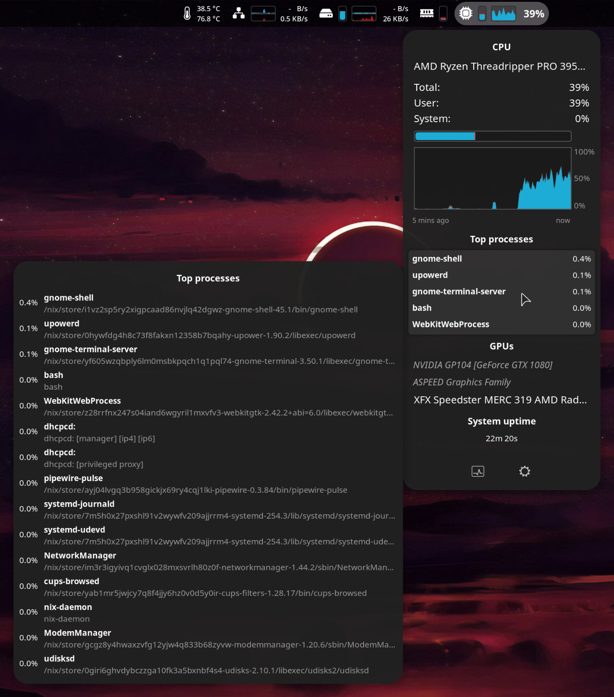
</p>
<p align="center">
    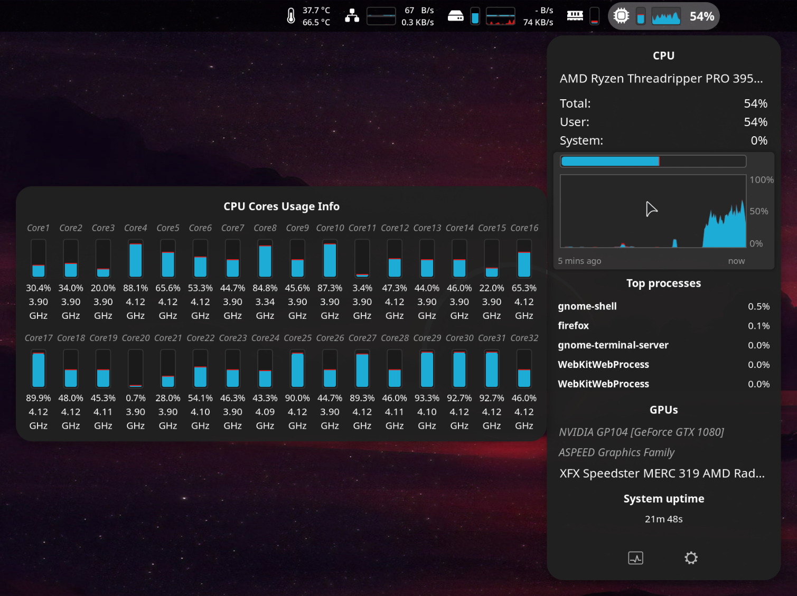
    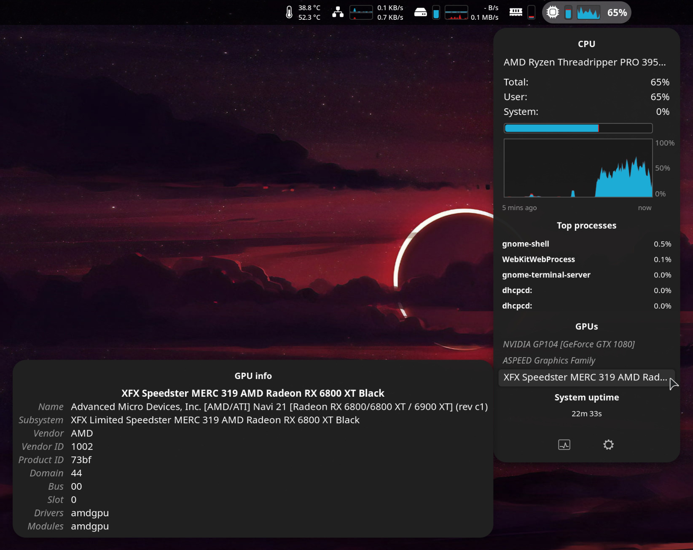
</p>

# 路线图

由于 Astra Monitor 处于 Beta 开发阶段，我们有一个雄心勃勃的路线图：

<table style="text-align:center" align="center">
    <tr>
        <th style="text-align:center" colspan="2">Beta<br>3/6</th>
        <th style="text-align:center" colspan="2">正式版<br>0/5</th>
    </tr>
    <tr>
        <th style="text-align:center">~2026</th>
        <th style="text-align:center">?</th>
        <th style="text-align:center">?</th>
    </tr>
    <tr>
        <td style="text-align:center">⌛<br>帮助和文档</td>
        <td style="text-align:center">🔲<br>主题</td>
        <td style="text-align:center">🔲<br>用户自定义命令</td>
    </tr>
    <tr>
        <td style="text-align:center">🔲<br>电池监控</td>
        <td style="text-align:center"></td>
        <td style="text-align:center"></td>
    </tr>
    <tr>
        <td style="text-align:center">🔲<br>持续监控模式</td>
        <td style="text-align:center"></td>
        <td style="text-align:center"></td>
    </tr>
</table>
<br>

要查看我们的_**完整路线图**_，包括过去的发布版本，请参阅 [ROADMAP.md](./ROADMAP.md) 文件。

您的反馈对于塑造 Astra Monitor 的开发旅程非常宝贵。您有什么新功能建议吗？我们非常高兴收到建议。让新功能尽快成为现实的最佳方式是直接贡献或捐赠。捐赠将带来更多开发时间来致力于项目。如果您想贡献，请参阅贡献指南。

# 安装

Astra Monitor 可以安装在支持 GNOME 45.0 或更高版本的任何 Linux 发行版上。

### GNOME 扩展管理器

大多数支持 GNOME 的发行版都支持直接从 GNOME Extensions 网站安装扩展。检查您的发行版是否已安装 GNOME Extensions Manager 应用。如果没有，您可以从软件包管理器/软件中心安装它。

### 使用 GNOME Extensions 网站

按照以下简单步骤操作：

1. 访问 [GNOME Shell Extensions 页面](https://extensions.gnome.org/)。
2. 搜索"Astra Monitor"。
3. 点击扩展并按照屏幕上的说明进行安装。

### NixOS

如果您使用的是 NixOS，可以通过在 `configuration.nix` 中添加以下内容来安装 Astra Monitor：

```nix
{ config, pkgs, ... }:

{
  environment.systemPackages = with pkgs; [
    gnomeExtensions.astra-monitor
  ];
}
```

# 依赖要求

Astra Monitor 开箱即用，无需额外依赖。但是，一些可选依赖可以增强扩展显示的数据。这些工具及其缺失的影响已在扩展的偏好设置面板中明确列出。

<p align="center">
    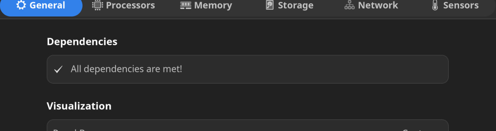
</p>

### Libgtop

如果您想使用 Libgtop 作为数据源，可能需要安装 `libgtop` 软件包。扩展运行不需要此软件包，但建议安装以获得更好的体验。

以下是一些流行 Linux 发行版上安装 `libgtop` 的非详尽列表：

#### Ubuntu/Debian

```bash
sudo apt install gir1.2-gtop-2.0
```

#### Fedora

```bash
sudo dnf install libgtop2-devel
```

#### Arch / Manjaro

```bash
sudo pacman -Syu libgtop
```

#### openSUSE

```bash
sudo zypper install libgtop-devel
```

#### NixOS

在 NixOS 上，您可能需要在 `configuration.nix` 中添加以下内容：

```nix
environment.variables = {
    GI_TYPELIB_PATH = "/run/current-system/sw/lib/girepository-1.0";
};
environment.systemPackages = with pkgs; [
    libgtop
];
```

### Nethogs

Nethogs 是扩展的可选依赖项。它是监控进程网络 I/O 活动所必需的。如果您想使用此功能，可能需要安装 `nethogs` 软件包。Nethogs 需要 root 访问权限，可以通过两种方式实现：

1. 按需启动：点击网络顶部进程标题以授予权限并以提升的权限启动 `nethogs`，约 60 秒。
2. 常驻模式：授予 `nethogs` 必要的功能（`cap_net_admin` 和 `cap_net_raw=ep`）作为特权服务运行。扩展将自动检测并在此配置中使用它。

以下是在大多数发行版上授予 `nethogs` 必要功能的方法：

1. 首先，找到 `nethogs` 二进制文件：

    ```bash
    which nethogs
    ```

2. 使用 `setcap` 授予功能：

    ```bash
    sudo setcap cap_net_admin,cap_net_raw=ep $(which nethogs)
    ```

3. 验证功能是否正确设置：
    ```bash
    getcap $(which nethogs)
    ```
    您应该看到类似以下的输出：
    ```
    /usr/sbin/nethogs = cap_net_admin,cap_net_raw=ep
    ```

_注意：`nethogs` 的确切路径可能因系统而异。如果 `which nethogs` 返回不同路径，请相应调整命令。_

授予这些功能后，重启 GNOME Shell，Astra Monitor 将自动检测并使用 `nethogs`，每次都不需要提升权限。

#### NixOS

在 NixOS 上，要授予 `nethogs` 功能，您可能需要在 `configuration.nix` 中添加以下内容：

```nix
environment.systemPackages = with pkgs; [
    nethogs
];

security.wrappers = {
    nethogs = {
        source = "${pkgs.nethogs}/bin/nethogs";
        capabilities = "cap_net_admin=ep cap_net_raw=ep";
        owner = "root";
        group = "root";
        permissions = "u+rx,g+x,o+x";
    };
};
```

_注意：这是一个示例配置，可能因您的特定 NixOS 设置而异。根据需要调整配置。_

### GPU

支持 AMD 和 NVIDIA GPU 的 GPU 监控。Intel 集成 GPU 目前不受支持。

#### AMD GPU

对于使用 AMD GPU（独立或集成）的用户，需要 [amdgpu_top](https://github.com/Umio-Yasuno/amdgpu_top) 来启用监控。

##### Ubuntu / Debian

```bash
sudo apt install amdgpu_top
```

##### Fedora

```bash
sudo dnf install amdgpu_top
```

##### Arch Linux / Manjaro

```bash
sudo pacman -S amdgpu_top
```

##### Rust (Cargo)

如果您安装了 `cargo`，也可以通过以下方式安装：

```bash
cargo install amdgpu_top
```

##### NixOS

在 NixOS 上，将 `amdgpu_top` 添加到您的 `configuration.nix`：

```nix
environment.systemPackages = with pkgs; [
    amdgpu_top
];
```

#### NVIDIA GPU

对于 NVIDIA GPU，需要 `nvidia-smi` 工具。此工具通常随专有 NVIDIA 驱动程序一起提供。

请参阅您发行版的官方文档以获取有关如何安装专有 NVIDIA 驱动程序的说明。

# 使用方法

安装后，可以直接从 GNOME 扩展工具访问和配置 Astra Monitor。您可以自定义要监控的系统资源以及信息的显示方式，根据您的需求定制体验。

# 许可证

Astra Monitor 采用 GNU 通用公共许可证 v3.0 (GPL-3.0) 许可，这是一项广泛使用的自由软件许可证，保证最终用户可以自由运行、研究、共享和修改软件。

# 翻译

Astra Monitor 目前提供英语、德语、捷克语和俄语版本。如果您想贡献翻译，请参阅以下指南：

1. **Fork 仓库：** Fork 仓库并将其克隆到本地计算机。
2. **创建/更新翻译文件：** 为您的语言创建或更新翻译文件。翻译文件位于 po 文件夹中。文件名是语言代码（例如，意大利语为 `it.po`）。您可以使用 Poedit 编辑翻译文件。
3. **编译翻译文件：** 使用 `./i18n.sh` 脚本编译翻译文件。
4. **测试翻译：** 通过使用 `./test.sh` 脚本运行扩展或使用 `./pack.sh` 打包并安装它来测试翻译。
5. **提交 Pull Request：** 提交包含您更改的 Pull Request。

_注意：需要 TypeScript 编译才能从源代码生成 JavaScript 文件。确保已安装 TypeScript 或在线搜索如何在您的系统上安装它。_

# 编译和测试

Astra Monitor 使用 TypeScript 编写，并使用 [GNOME Shell Extension API](https://gjs.guide/)。

您可以运行 `npm install`、`yarn install`（使用 Yarn）或 `nnpm install`（使用 NNPM）来安装所有依赖项。

提供了各种脚本以方便扩展的打包和测试。这些脚本位于项目的根目录中，可以从那里运行。它们仅用于方便我自己的开发过程。请随意使用或修改它们以满足您的需求。

### 脚本

-   **`test.sh`：** 在 Xephyr 会话中的 GNOME 嵌套 Wayland 会话中编译、打包、安装和运行扩展，允许您在不重启自己 GNOME Shell 会话的情况下轻松测试。可以通过以下命令运行：

    ```
    bash ./test.sh
    ```

-   **`schemas.sh`：** 此脚本编译扩展的架构。可以通过以下命令运行：

    ```
    bash ./schemas.sh
    ```

-   **`i18n.sh`：** 此脚本为扩展创建翻译文件。可以通过以下命令运行：

    ```
    bash ./i18n.sh
    ```

-   **`pack.sh`：** 此脚本将扩展打包成 zip 文件以进行分发或使用。它会自动检查依赖项并编译架构。可以通过以下命令运行：

    ```
    bash ./pack.sh
    ```

-   **`compile.sh`：** 此脚本将 TypeScript 源代码编译成 JavaScript；输出放在 `dist` 目录中。可以通过以下命令运行：

    ```
    bash ./compile.sh
    ```

# 贡献

我们非常鼓励和感谢对 Astra Monitor 的贡献。我们欢迎各种形式的贡献，从错误报告到功能建议，以及直接的代码贡献。贡献方式：

1. **报告错误/请求功能：** 使用 GitHub issues 页面报告错误或建议新功能。
2. **代码贡献：** 随时进行更改并提交 pull request。
3. **反馈：** 分享您的经验和建议以帮助改进 Astra Monitor。

请参阅我们的贡献指南以获取更详细的说明。

# 捐赠

Astra Monitor 是一个免费的开源项目：我们依靠社区的支持。捐赠是维持项目增长和成功的重要部分。您的贡献使我们能够将更多时间用于开发，并将社区最请求的功能变为现实。

### 您的捐赠如何提供帮助

-   **更多开发时间**：捐赠使我们的团队能够将更多时间直接用于项目开发，从而加快发布和更新速度。
-   **社区驱动的功能**：通过额外资源，我们可以专注于实现社区最请求的功能。
-   **增强项目可持续性**：您的支持帮助我们长期维护项目，确保其持续改进和相关性。

### 如何捐赠

您可以通过您首选的平台捐赠。任何金额都非常感谢，并将产生重大影响。

**请我们 [喝杯咖啡](https://www.buymeacoffee.com/astra.ext)，帮助我们保持 Astra Monitor 的活力！**

**成为我们的 [赞助商](https://www.patreon.com/AstraExt) 来支持我们的项目！**

**通过 [Ko-Fi](https://ko-fi.com/astraext) 捐赠，帮助我们的社区成长！**

## 鸣谢

Astra Monitor 是一个受 [iStat Menus](https://bjango.com/mac/istatmenus/) 和 [TopHat](https://github.com/fflewddur/tophat) by [Todd Kulesza](https://github.com/fflewddur) 概念启发的项目，为 GNOME 环境进行了调整和演变。此扩展是对系统监控工具创新的致敬，并由开源社区的热情和贡献驱动。

## Star 历史

<a href="https://star-history.com/#AstraExt/astra-monitor&Date">
  <picture>
    <source media="(prefers-color-scheme: dark)" srcset="https://api.star-history.com/svg?repos=AstraExt/astra-monitor&type=Date&theme=dark" />
    <source media="(prefers-color-scheme: light)" srcset="https://api.star-history.com/svg?repos=AstraExt/astra-monitor&type=Date" />
    
  </picture>
</a>
